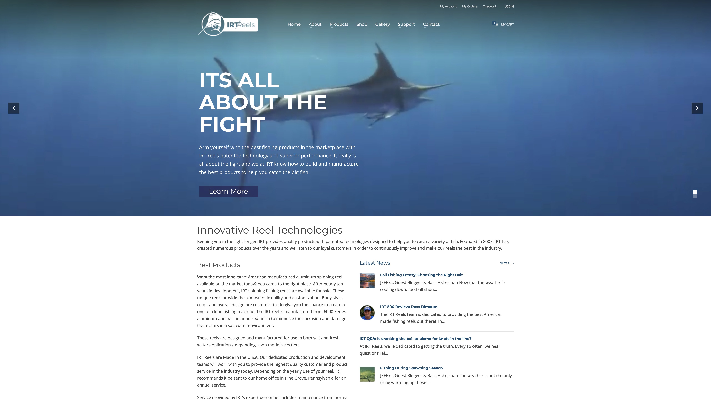
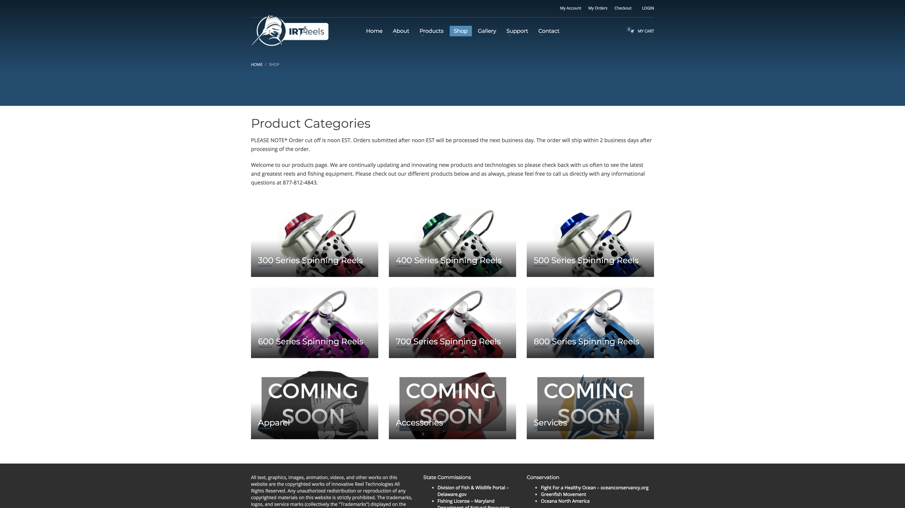
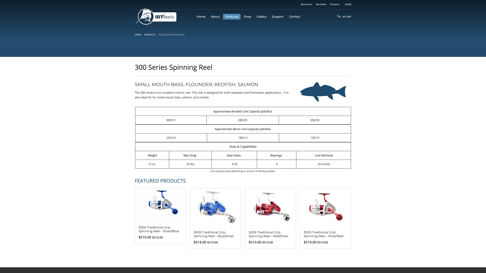
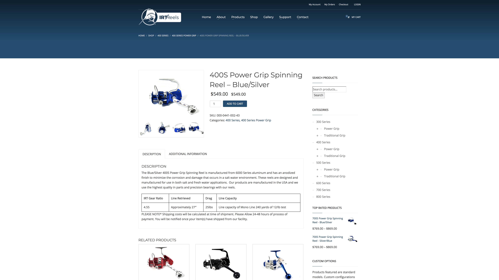

# IRT Reels
Keeping you in the fight!

## Redesign

The goal of the redesign was to create higher quality user experiences, create channels for organic community engagement, and for the codebase to be scalable and easily maintainable.

### Old Site

The original site was built upon WordPress utilizing [WooCommerce](https://woocommerce.com/) and [Kallyas](https://kallyas.net/).

As you'll see below, the information on the site was largely fragmented and the natural flow for users is ill defined.

**Homepage**

**Product Categories**

**Product Specifications**

**Products in Category**

**Product Page**

## New Site
The rebuild takes a more [*serverless*](https://en.wikipedia.org/wiki/Serverless_computing) approach. There's a network of technologies that ends up powering the site. These technologies are:

- [Jekyll](https://jekyllrb.com/)
- [Shopify](https://www.shopify.com/)
- [Slack](https://slack.com/)
- [Crisp](https://crisp.chat/en/)

As well as several other techs and APIs that are to come with subsequent updates.

### Jekyll
Jekyll is a [static site generator](https://davidwalsh.name/introduction-static-site-generators) which means that the pages are precompiled prior to a user visiting the website. This creates better performance and development flexibility at the cost of a pretty [GUI](https://en.wikipedia.org/wiki/Graphical_user_interface) for content management. 

The elegance of this is that Jeklyl uses the same templating engine, [Liquid](https://shopify.github.io/liquid/), as Shopify. This would allow the site to be integrated directly into the Shopify backend as a theme. 

The base theme, [Solar Flair](https://github.com/ndkline/solar-flair), was developed for usage across  [Solar Innovations](https://solarinnovations.com/), [IRT Reels](https://irtreels.com/), [Planning Solar](https://planning.solar/) and [Universal Clamps](https://universalclamps.com/) web presences. Because of this consistency we can cache assets, like CSS, JS, images, etc..., for use between sites.

### Shopify
Shopify took the place of our backend for the most part, WooCommerce and WordPress. All the business functions are isolated within this system.

The UX/UI that Shopify provides is easily the best on the market. 

### Slack 
Slack is one of the most beloved pieces of technology that's revolutionized distributed teams. Our Staff, Pro Staff, and a few others have access and can collaborate quite effectively. 

This also serves as a cheap notification server. When blogs are published a bot will dump a link to it in a channel.

### Crisp
Crisp is a services that allows us to achieve top tier customer support. It provides a chat widget on the website itself that integrates with Slack. The service also routes our Facebook Messenger and Twitter DMs to the same location, so support staff do not have to use multiple applications.

